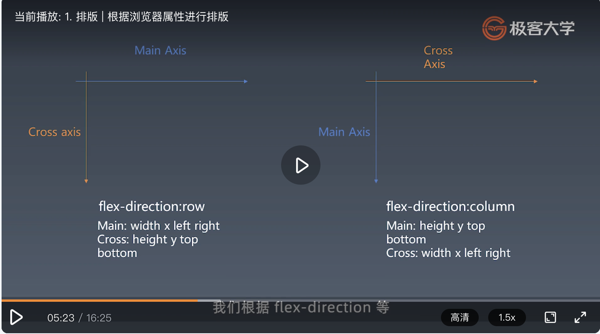
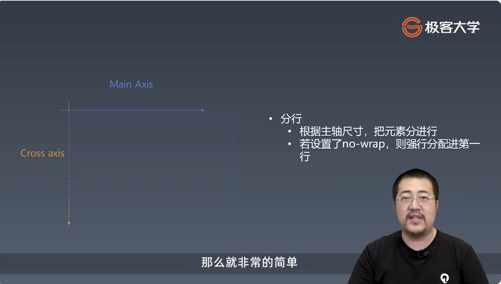

学习笔记

# 第十周 浏览器工作原理（第四周）  

## 1. 排版 | 根据浏览器属性进行排版  

  

主轴：排版时主要的延伸方向  
交叉轴：跟主轴垂直  

  

三代排版技术：1、正常流 2、flex 3、grid

## 2. 排版 | 收集元素进行  

  

### 分行  

> + 根据主轴尺寸，把元素分进行
> + 若设置了no-wrap，则强行分配进第一行

## 3. 排版 | 计算主轴  

### 计算主轴方向  

> + 找出所有 Flex 元素  
> + 把主轴方向的剩余尺寸按比例分配给这些元素  
> + 若剩余空间为负数，所有flex元素为0，等比压缩剩余元素

## 4. 排版 | 计算交叉轴  

### 计算交叉轴方向  

> + 根据每一行中最大元素尺寸计算行高  
> + 根据行高flex-align 和 item-align,确定元素具体位置  

## 5. 渲染 | 绘制单个元素  

> + 绘制需要依赖一个图形环境  
> + 绘制在一个 viewport 上进行  
> + 与绘制相关的属性：background-color, border, background–image  

## 6.绘制 DOM  

> + 递归调用子元素的绘制方法完成 DOM 树的绘制  
> + 忽略一些不需要绘制的节点  
> + 实际浏览器中，文字绘制是难点，需要依赖字体库  
> + 实际浏览器中，需要图层处理
