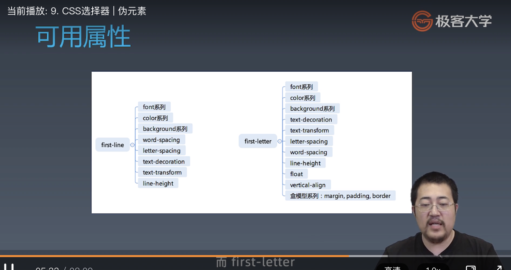

学习笔记  

# 重学 CSS  

## 1. CSS总论 | CSS语法的研究  

## 2. CSS总论 | CSS @规则的研究  

## 3. CSS总论 | CSS规则的结构  

## 4. CSS总论 | 收集标准  

## 5. CSS总论 | CSS总论总结  

## 6. CSS选择器 | 选择器语法  

## 7. CSS选择器 | 选择器的优先级  

/**  
到具体的计算层⾯，优先级是由 A 、B、C、D 的值来决定的，其中它们的值计算规则如下：  
A 的值等于 1 的前提是存在内联样式, 否则 A = 0;  
B 的值等于 ID选择器 出现的次数;  
C 的值等于 类选择器 和 属性选择器 和 伪类 出现的总次数;  
D 的值等于 标签选择器 和 伪元素 出现的总次数 。  
选择器的权重  
   内联样式          1,0,0,0  
   id选择器          0,1,0,0  
   类和伪类选择器     0,0,1,0  
   元素选择器         0,0,0,1  
   通配符选择器         0，0，0，0  
   继承的样式         没有优先级  
   
   比较优先级时，需要将所有选择器的优先级进行相加计算，最后优先级越高，则 越优先显示。  
   注意，分组选择器是单独计算的  
   选择器的累加，不会超过其最大的数量级，比如，类选择器累加再高也不会超过id选择器  
   
   一般，选择器越具体，优先级越高  
   
   如果，选择器优先级相同，则优先使用靠下的样式，即后声名的选择器覆盖前边的选择器  
   
   !important 表示赋予最高优先级，超过内联样式。  
      注意，在开发中，一定要慎用  
*/

div#a.b .c[id=x]   
0 1 3 1   
S= 0 * N^3 + 1 * N^2 + 3 * N^1 + 1  
取 N = 1000000  
S = 2000001000001  
#a:not(#b)   
0 2 0 0   
S= 0 * N^3 + 2 * N^2 + 0 * N^1   
取 N = 1000000  
S = 2000002000000  
*.a   
0 0 1 0   
S= 0 * N^3 + 0 * N^2 + 1 * N^1   
取 N = 1000000  
S = 1000000  
div.a   
0 0 1 1  
S= 0 * N^3 + 0 * N^2 + 1 * N^1 + 1  
取 N = 1000000  
S = 1000001  

## 8. CSS选择器 | 伪类  

### 链接/行为  

> + :any-link  // 匹配所有的超链接  
> + :link :visited  
> + :hover  
> + :active  
> + :focus  
> + :target  

### 树结构  

> + :empty  
> + :nth-child()  
> + :nth-last-child()  
> + :first-child  :last-child  :only-child  

### 逻辑型  

> + :not 伪类  // 只有这个可用  
> + :where :has  

## 9. CSS选择器 | 伪元素  

### 伪元素  

// 表示在内容的前后插入一个伪元素  

> + ::before  
> + ::after  

// 选中第一行和选中第一个字母，用不存在的元素，把部分文本给括了起来  
  
> + ::first-line  
> + ::first-letter  

  
