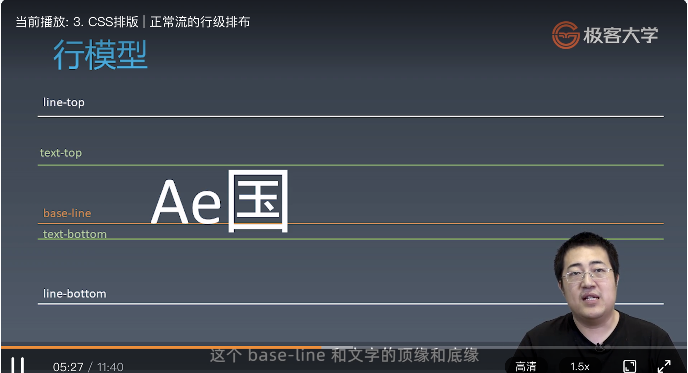
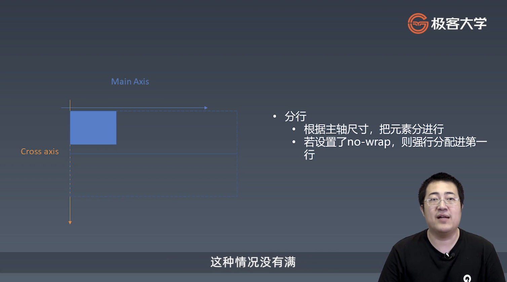
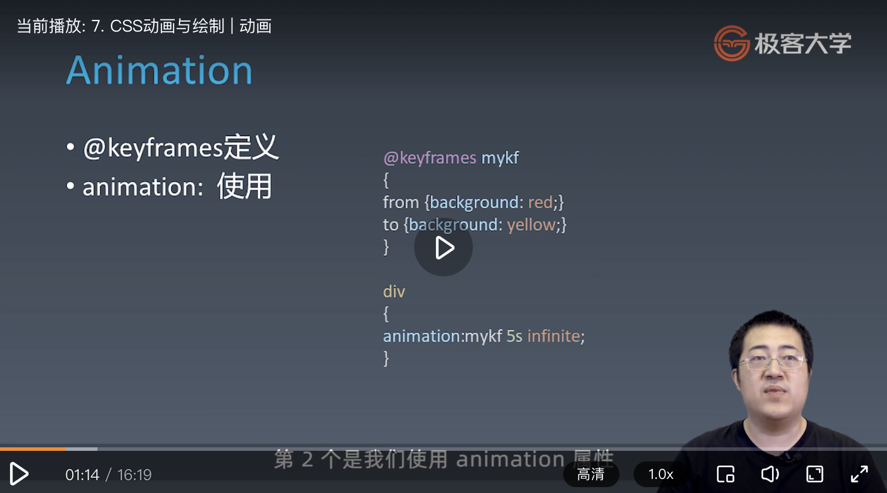
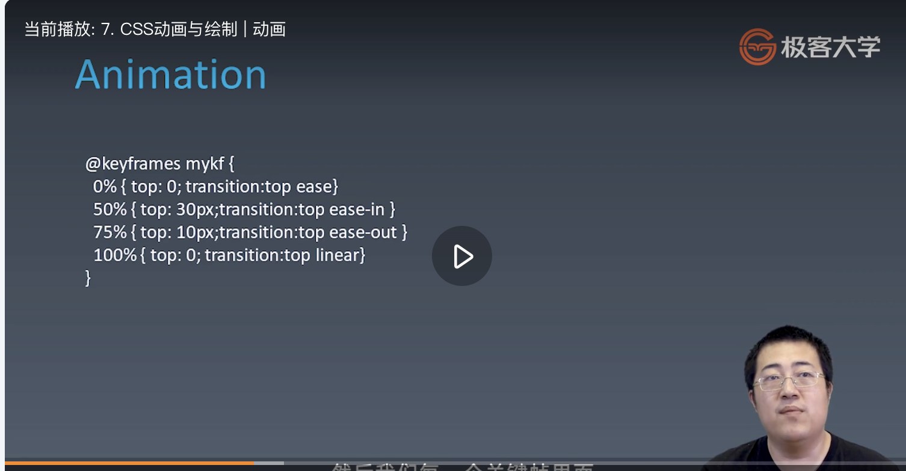

学习笔记

# 重学 CSS  

## 1. CSS排版 | 盒  

HTML代码中可以书写开始_标签___，结束__标签__，和自封闭__标签__ 。  

一对起止__标签__ ，表示一个__元素__ 。  

DOM树中存储的是__元素__和其它类型的节点（Node）。  

CSS选择器选中的是_元素___ 。  

CSS选择器选中的_元素___ ，在排版时可能产生多个__盒__ 。  

排版和渲染的基本单位是__盒__ 。  

### 盒模型  

  

#### box-sizing  

> + content-box
> + border-box  (包含border、padding、content)  

## 2. CSS排版 | 正常流  

### 正常流排版  

> + 收集盒和文字进行  
> + 计算盒和文字在行中的排布  
> + 计算行的排布  

IFC左（行内级格式化上下文），  BFC上下排列的上下文（块级格式化上下文）  

## 3. CSS排版 | 正常流的行级排布  

  

## 4. CSS排版 | 正常流的块级排布  

### float 与 clear  

## 5. CSS排版 | BFC合并  

### Block  

> + Block Container:里面有BFC的  
>  
>> + 能容纳正常流的盒，里面就有BFC  
>>
> + Block-level Box:外面有BFC的  
>
> + Block Box = Block Container + Block-level Box:
> 里外都有BFC的  

#### Block Container  

> + block  
> + inline-block  
> + table-cell  
> + flex item  
> + grid cell  
> + table-caption  

#### Block-level Box  

> + Block level  
>  
> > + display:block  
> > + display:flex  
> > + display:table  
> > + display:grid  
> > + ……  
>  
> + Inline level  
>  
> > + display:inline-block  
> > + display:inline-flex  
> > + display:inline-table  
> > + display:inline-grid  
> > + ……  

## 6. CSS排版 | Flex排版  

### Flex 排版  

> + 收集盒进行  
> + 计算盒在主轴方向的排布  
> + 计算盒在交叉轴方向的排布  

  

## 7. CSS动画与绘制 | 动画  

  

### Animation  

> + animation-name  时间曲线  
> + animation-duration 动画的时长  
> + animation-timing-function 动画的时间曲线  
> + animation-delay 动画开始前的延迟  
> + animation-iteration-count 动画的播放次数  
> + animation-direction 动画的方向  

  

### Transition  
  
> + transition-property 要变换的属性  
> + transition-duration 变换的时长  
> + transition-timing-functiion 时间曲线  
> + transition-delay 延迟  

cubic-bezier.com  

## 8. CSS动画与绘制 | 颜色  

## 9. CSS动画与绘制 | 绘制  

### 绘制  

> + 几何图形  
>  
> > + border  
> > + box-shadow  
> > + border-radius  
> >  
> + 文字  
>  
> > + font  
> > + text-decoration  
> >  
> + 位图  
>  
> > + background-image  